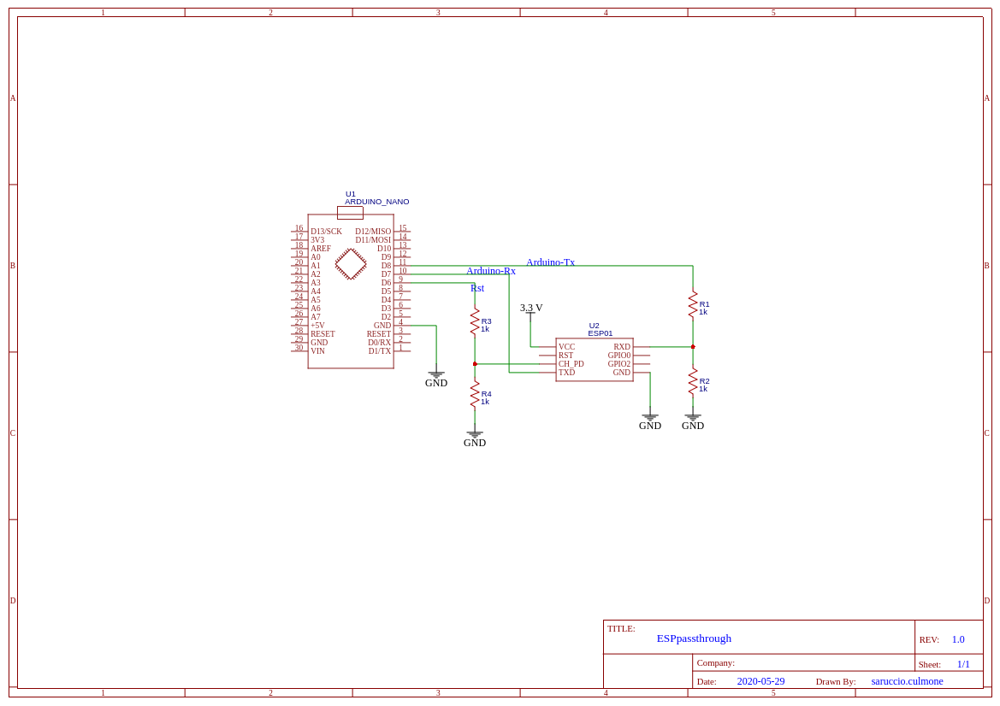

# ESPpassthrough
Library that uses ESP AT serial commands to set it in Passthrough (transparent) Mode.

## Rationale
In some projects there is the need to remotize a serial communication protocol.

The simplest way to achieve this is to remotize the serial port data stream via 
a TCP network connection so that every byte sent to the socket will be received 
by the serial port and vice versa.

The ESP-01 is the best candidate for this kind of work because of its rich set of WiFi functionalities.
One of these is the transmission in passthrough mode but you need to configure it using its AT command interface.

The aim of this library is to make this ESP-01 configuration easy.

### Remotization Pros

Using serial remotization there is no need to change the application protocol
implemented over the serial port.

At any time the physical serial connection can be restored simply disabling the 
library in the middle and connecting a serial TTL adapter ti Rx and Tx lines.


## Usage

### Hardware configuration

Connect the ESP-01 to the serial port you plan to remotize.

If SoftwareSerial is used, connect the ESP-01 to the IO pin 
configured to be used as Tx and Rx.

In the following image the schematic of the test bench I used.



#### Pay attention

The ESP-01 need to be powered at 3.3V but the 3.3V output on the Arduino board cannot supply the current needed by the ESP-01 to work properly.

So it must be powered by a different line, otherwiwse strange and unexpected behaviours will appear at its serial interface.

### Software

The steps to use the library are the following:

1. create and configure the serial port you plan to remotize;
2. define a ESPpassthrough object using that serial port;
3. use the object to connect one available WiFi Acces Point;
4. use the object to connect a TCP listening server/port 

   (for example a ```netcat -l -p <port>``` running on a remote Linux PC)
5. if all previous steps complete successfully, do data exchange directly on the serial port; 
6. if you need to close the TCP connection and/or disconnect from the AP, stop send/receive data fron the remotized serial port and use disocnnection methods of the ESPpassthrough object.

# Example

In the folder *example* there is an Arduino sketch that implements the steps listed in the [Software](#Software) section.


# Debugging

For debugging purposes you can enable or disable the tracing of the library at compile time uncommenting or commenting the definition of the macro TRACE_ON:

```#define TRACE_ON 1```

uncommented in the code by default.

It enables two other macros

```PRINT(x)``` and ```PRINTL(X)```

printing over the Serial object.


# Limitations

At the moment the library does not support auto bauding, so is in charge of you to ensure that the baudrate of both serial ports (the one of the Arduino and the one of the ESP-01) are the same.

Usually default baudrate of the ESP-01 serial port is 115200 (at least for the ones I bought).

If you need different baudrate you have to connect the ESP-01 to a TTL 3.3V serial adapter and set it issuing the command:

```AT+UART_DEF:<baudrate>,<databits>,<stopbits>,<parity>,<flow control>```

in order to make your changes persistent.

For example, to set a baudrate of 9600 bps, 8 bit of data, 1 stop bit, no parity bit and no flow control, the command is:

```AT+UART_DEF=9600,8,1,0,0```

*Note*
*Depending on the firmware version on the ESP-01 this command could return ERROR even if it succeded*


# ToDo - Improvements

## Auto baudrate

As stated in the section [Limitations](#Limitations), the autobauding is missing.

I developed this library as a part of another hobby project.
At the moment it meets my needs, therefore, due to my limited spare time, I don't plan any improvements soon.

You are welcome to contribute.


